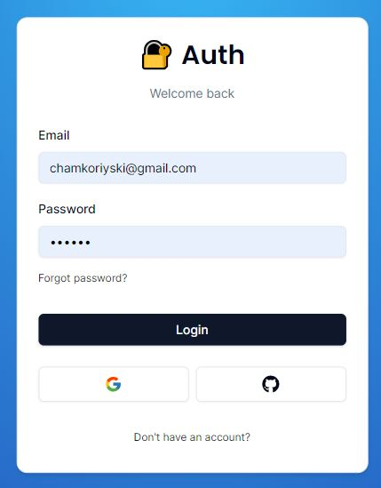

# Auth V5

## Built With

- Major languages: TypeScript
- Framework: Next.js
- Libraries: Prisma, Auth.js, React

## Screenshots

## Getting Started

- cloning the repository by running `git clone [https://github.com/Apurv428/nextjs-auth)`
- cd into the project directory `cd nextjs-auth`
- Install the dependencies by running `npm install` or `yarn install`
- Run the development server by running `npm run dev` or `yarn dev`
- Open your browser and navigate to `http://localhost:3000`

## Environment Variables

You will need to create a `.env` file in the root of the project and add the following environment variables:

DATABASE_URL= 
DIRECT_URL= 
AUTH_SECRET= 
GITHUB_CLIENT_ID= 
GITHUB_CLIENT_SECRET= 
GOOGLE_CLIENT_ID= 
GOOGLE_CLIENT_SECRET= 
RESEND_API_KEY= 
NEXT_PUBLIC_APP_URL="http://localhost:3000" or your production URL
